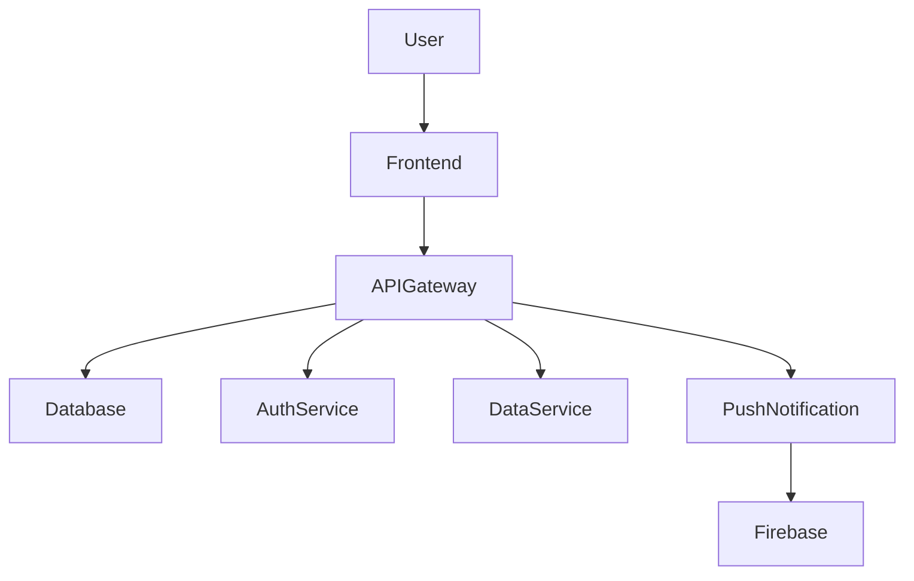

# Ownd-App

Ownd is a habit-tracking and journaling app designed for personal growth, accountability, and mindfulness, offering role-based features where **Dominants** set tasks (habit setters) and **Submissives** track progress (habit trackers). The app also incorporates journaling, encrypted messaging, and gamified elements to enhance engagement.

---

## Key Features

### Habit Tracking
- **Customizable Reminders**: Set reminders for tasks and habits with flexible scheduling options.
- **Role-Based Task Management**: Dominants (habit setters) create tasks for Submissives (habit trackers) to complete.
- **Visual Habit Chains**: Track habit streaks and visualize progress over time with chain visualizations.

### Journaling
- **Rich Text Editor**: Journal entries support rich text formatting with bold, italics, lists, and more.
- **Privacy Options**: Journal entries can be set as private, shared (with specific users), or public.
- **Categories**: Entries are categorized into Private, Shared, Public, and Erotica, with an easy-to-use filter system.

### Encrypted Chat
- **End-to-End Encryption**: Secure messaging between Dominants and Submissives, ensuring privacy.
- **Burn-on-View Media**: Media files (images, videos) can be sent and viewed once, with options to delete after viewing.
- **Screenshot Prevention**: Burn-on-view media are protected from screenshots via time limits and watermarking.

### Gamification
- **Habit Badges**: Earn badges for consistency, completion, and reaching milestones.
- **Self-Reflection Prompts**: Basic prompts included in the standard version, with more advanced prompts in the premium version.
- **Achievements**: Unlock achievements based on progress and consistency.

### Push Notifications
- **Smart Notifications**: Customizable push notifications to remind users of pending tasks and journal reflections.
- **Habit Chains**: Push notifications inform users of habit streaks and motivate them to keep the chain alive.

### Accessibility and Customization
- **Dark Mode**: A visually soothing dark mode for low-light environments.
- **Text Resizing**: Adjustable text sizes for improved readability.
- **Colorblind Mode**: Support for different types of color blindness.
- **Voice Navigation**: Navigate through the app using voice commands (premium feature).

### Privacy and Security
- **End-to-End Encryption**: Applied to both chat messages and journal entries.
- **Burn-on-View Messaging**: Automatic deletion of sensitive media after viewing.
- **Data Anonymization**: All analytics data is anonymized to protect user privacy.
- **Enhanced Privacy Controls**: Users can request emergency deletion of sensitive data with the option to download before deletion.
- **Multi-Factor Authentication (MFA)**: Ensures secure login and account access.

---

## Premium Features
- **Mentorship System**: Future feature allowing guidance and accountability between mentors and users.
- **Gamified Self-Reflection Journal**: Enhanced journaling with prompts and data insights (basic prompts are available in the standard version).
- **Locale-Based Habit Suggestions**: Customized habit suggestions based on the user’s location and culture.
- **Advanced Analytics**: Detailed insights and visualizations of habit performance and progress over time.

---

## Project Structure

```plaintext
Ownd-App/
+-- backend/                # Node.js/Express backend
    +-- models/             # MongoDB schemas for user, journal, chat, habits
    +-- routes/             # API routes for habits, journals, chats
    +-- middleware/         # Middleware for authentication (JWT)
    +-- server.js           # Main server file
+-- frontend/               # React frontend
    +-- src/                # React app source code
        +-- components/     # React components (habit tracker, journal, chat, etc.)
        +-- services/       # API service for interacting with backend
    +-- App.js              # Main React app file
    +-- index.js            # App entry point
    +-- public/             # Static assets and index.html
+-- docs/                   # Documentation files (readme, terms, privacy, etc.)
+-- Testing/                # Unit and integration tests
+-- README.md               # Project overview and instructions
```

## Technologies Used

### Backend
- **Node.js/Express**: Handles all API requests and routes for the app.
- **MongoDB**: NoSQL database for storing user data (habits, journals, chats).
- **JWT Authentication**: Provides secure token-based authentication for user sessions.
- **Firebase**: Push notification service for reminders and updates.

### Frontend
- **React.js**: Modern frontend framework for building the user interface.
- **D3.js**: Used for interactive data visualizations, including habit chains and progress tracking.
- **React-Quill**: Rich text editor for journaling with formatting options.
- **CSS/SCSS**: Customizable themes with dark mode and accessibility options.

---

## Data Flow Diagram (DFD)



## Entity Relationship Diagram (ERD)

```mermaid
erDiagram
    USER {
        string userId
        string email
        string role
        string password
    }
    HABIT {
        string userId
        string title
        string frequency
        string status
    }
    JOURNAL {
        string userId
        string content
        string category
        string createdAt
    }
    MESSAGE {
        string senderId
        string content
        string media
        boolean isBurnOnView
    }
    USER ||--o{ HABIT : has
    USER ||--o{ JOURNAL : writes
    USER ||--o{ MESSAGE : sends
````

## Documentation

- **User Guide**: [docs/UserDocumentation.md](docs/UserDocumentation.md)
- **Developer Guide**: [docs/DeveloperDocumentation.md](docs/DeveloperDocumentation.md)
- **Privacy Policy**: [docs/PrivacyPolicy.md](docs/PrivacyPolicy.md)
- **Functionality Overview**: [docs/FunctionalityOverview.md](docs/FunctionalityOverview.md)
- **Data Flow and ERD**: [docs/DataFlowAndSchema.md](docs/DataFlowAndSchema.md)

---

## Testing

- **Unit Testing**: Automated tests for individual components.
- **Integration Testing**: End-to-end tests to ensure all components function together.
- **Security Audits**: Regular checks for vulnerabilities and data protection compliance.

---

## Getting Started

To get started with Ownd, follow the installation steps below:

### Prerequisites
- **Node.js** (version 14.x or higher)
- **MongoDB** (v4.4 or higher)
- **Firebase** account for push notifications

### Installation Steps

1. Clone the repository:
   ```bash
   git clone https://github.com/your-username/ownd-app.git
   cd ownd-app

2. Install backend dependencies:
```bash
cd backend
npm install
```

3. Install frontend dependencies:
```bash
cd ../frontend
npm install
```

4. Configure environment variables: Create a .env file in the backend directory and add your MongoDB, JWT, and Firebase credentials.

Run the development servers:

Backend:
```bash
cd backend
npm start
```

Frontend:
```bash
cd frontend
npm start
```

## Contributing
Contributions are welcome! Please follow our contribution guidelines before submitting pull requests.

## License
This project is licensed under the MIT License - see the LICENSE.md file for details.

## Contact and Feedback
For any issues, feedback, or inquiries, please contact the Ownd development team
